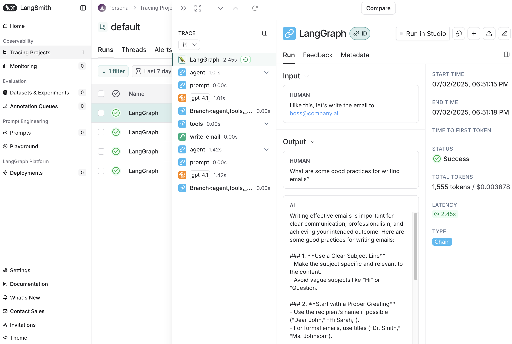
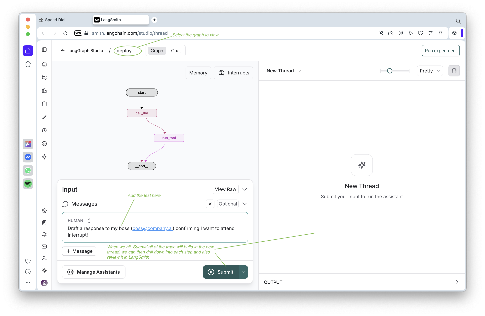

# Introduction
This provides an overview of LangGraph and functions as a quick crash course on the key aspects of LangGraph itself.
## Chat
See [chat_models](./01_chat_models.ts).
```

                                  AGENT
                            -------------------
       User request ------> | LLM ---->       |
USER      Output    <------ |     <---- Tools |
                            -------------------
```
In a typical chat use case a user makes a request to an agent, the agent calls some tools and generates a response to the user. So how do we go beyond this when a user does not want to be conversing with the agent to get things done?
## Ambient Agents
|                      |       Chat Agents        |    Ambient Agents    |
| :------------------- | :----------------------- | :------------------- |
| Agent Trigger        | User message/request     | Listening to events  |
| Concurrency          | ~1 user request          | Many events          |
| UX                   | Chat UI/await completion | Background/notify me |
| Latency Requirements | Needs to be fast         | Can take longer      |
## E-mail management agent
In this module the aim is to build an e-mail management agent to handle your in-box, some key features are using LangGraph for the agent, adding human-in-the-loop to get feedback on proposed actions (before sending anything!) and using persistence to form memory.
```
                                                                                                                 E-mail service
            ---------------                           -------------      ------------------                     /
E-mail ---> |    Agent    | ---> E-mail response ---> | Interrupt | ---> | Human Feedback | ---> Approved e-mail
input       | (LangGraph) |          draft            -------------      |  (Agent inbox) |                     \ Run agent tests
            ---------------                                              ------------------                      -----------------
                   ^                                                             |                               |    Testing    |
                   |                                                             \/                              |  (LangSmith)  |
           ----------------         Learn preferences over time          -------------------                     -----------------
           |   Memory     | <------------------------------------------- | Memory updating |
           ----------------                                              -------------------
```
### Models for building the solution
```
  ^
P |
r |  1 Prompt LLM
e |
d |              2 Router workflow
i |
c |
t |
a |
b |
i |
l |
i |
t |                             3 Agent
y |
   ---------------------------------------->
                  Agency
```
#### 1 Prompt LLM
See [workflows](./02_workflows.ts).
```
        Prompt   E-mail tool      
            \     /
             \   /
E-mail -----> LLM -----> Tool Call -----> Run tool -----> E-mail sent
```
This is a simple prompt based agent where you make a request for an e-mail to be sent, the LLM generates a response but in a structured format to call a tool to send the email. In this case it is the tool that provides some level of agency (it could be an API to and email sender). The agent generates an output to conform to the API and the email is sent. This is highly predictable as a request comes in and an email is sent. Note that in JS the state is the `Annotation` object.
#### 2 Router workflow
See [router_workflow](./03_router_workflow.ts).
```
            Router
            Prompt                    Prompt   E-mail tool      
               |   ----> { ignore }       \     /
               |  /                        \   /
E-mail -----> LLM -----> { respond } -----> LLM -----> Tool Call -----> Run tool -----> E-mail sent
                  \
                   ----> { notify }
```
In this case we can add some predefined behaviors based on incoming emails. In this case we can add a routing LLM that decides if we want to send an email, not send an email or notify the inbox owner based on some pre-set criteria. Should the decision be to send an email and e-mail agent is called similar to the first email. This is has more agency as decisions are made up front but the predictability is lower, we don't always send an email. Note that in JS the state uses the `MessagesAnnotation` object instead of `MessagesState`.
#### 3 Agent
See [router_agent](./04_router_agent.ts).
```
        Prompt    Tools      
            \     /
             \   /
E-mail -----> LLM -----> Tool Call -----> Run tool -----> Loop termination
               ^                             |
               |_____________________________|
```
In this case the agent has a collection of tools, after a tool call the agent considers the response and decides what to do next. The loop repeats until a termination condition is met. This has higher agency as the agent controls the decisions and actions and is less predictable. The agent can call any sequence of tools that is has.
### Workflows V's agents
|                      | Workflow                          | Agent                                     |
| :------------------- | :-------------------------------- | :---------------------------------------- |
| Action sequence      | Easy to enumerate in advance      | Unknown until runtime (depends on input)  |
| Process              | Linear or branching control flow  | Flexible decision making (backtracking)   |
| Performance          | Latency/cost are crucial          | Ok to trade-off for more reasoning        |

**Heuristic:** If you can easily draw the flow of control on a whiteboard, a simple workflow will probably do.
## LangGraph
As we saw in the code, LangGraph is a workflow framework for building agent applications, at the core we have:
|      | Description     |
| :------------- | :------------- |
| Node  | A unit of work (code) to give imperative direct control. |
| Edge  | A declarative transition between nodes.                  |

These components can be composed into directed graphs with a start node. This allows us to combine workflows and agents, this provides us with a way of transitioning between the low agency/high predictability of a pure workflow agent to the high agency/low predictability of a full agent (or any stage in between).

Another important element in LangGraph is the persistence layer, this allows us to pause the application and save the state. This enables human-in-the-loop interactions, long running actions and the ability to build long-term memory.

There are several tools we will use to build the application:
| Tool | Purpose |
| :--- | :------ |
| LangSmith | Observability (tracing and evaluation) |
| LangGraph | Orchestration (application control flow) |
| LangChain | Integrations (standard interfaces) |

The benefits we from using LangGraph are:

* **Control:** It is simple to define and/or combine agents and workflows.
* **Persistence:** We can store the graph state for memory or human interactions.
* **Test, debug, deploy:** We have an on-ramp to manage our applications.

### Control
We created our graph with:
1. *State:* The information we need to track over the course of the application.
2. *Nodes:* How we update this information.
3. *Edges:* How we link the nodes together.

### Persistence
See [persistence](./05_persistence.ts).
```
Graph        {state:"I"} --> Node_1 --> Node_2 --> {state: "I heart langgraph"}        Control flow of nodes, edges

Super-steps                  Node_1     Node_2                                         Each sequential node is a separate
                                                                                       super-step, while parallel nodes
                                                                                       share the same super-step.

                 --------------------          ------------------------------
                 | state: "I heart" |          | state: "I heart langgraph" |          State and relevant metadata packaged
Checkpoints      | next: node_2     |          | next: END                  |          at every super-step
                 | id: ......       |          | id: ......                 |
                 | etc: ......      |          | etc: ......                |
                 --------------------          ------------------------------

                 - - - - - - - - - - - - - - - -
                 |                             |
Thread           |   node_1          node_2    |                                       Collection of checkpoints
                 |                             |
                 - - - - - - - - - - - - - - - -

StateSnapshot       StateSnapshot()        StateSnapshot()                             Type for checkpoints
```
The persistence layer in LangGraph is built on checkpoints, these happen after each node and save the condition of the state after each node processes it.

### Interrupts
See [interrupts](./06_interrupts.ts) (note that the resume is commented out for the first run).
We can also use interrupts to stop execution of a graph at specific points, often to collect user input, then to continue execution taking into account the users input.

## Tracing

With tracing switched on you can log into [LangSmith](https://smith.langchain.com/) and take a look at the interactions that have taken place during a run of our code. With this we can drill down to the LLM calls, tool calls, what the agent did, calls made. It's possible to drill down into our interactions, this is especially useful for debugging. This requires we set the `LANGCHAIN_API_KEY` and `LANGSMITH_TRACING` flag in our environment.

## Deployment
[LangGraph Platform](https://www.langchain.com/langgraph-platform) allows us to deploy our project and creates a server with an API, this can be used in conjunction with an interactive IDE called [LangGraph Studio](https://langchain-ai.lang.chat/langgraph/concepts/langgraph_studio/). The configuration of a project relies on the inclusion of the `langgraph.json` configuration file in the project root. The key elements are the graph name and the path to it. The simplest free option is to run `npx @langchain/langgraph-cli dev` in the root folder with the config file, here checkpoints are saved locally. There are hosted environments that use Postgres via the postgres checkpointer. Note that one thing you need to do in JS is `export` your graph and ensure the graph name you export is the name you used in your `langgraph.json`.

See [deploy](./07_deploy.ts) graph code and the [config](./langgraph.json) files.

To run these on the local server in the `\01_LangGraph_101` folder run the following:
```
npx @langchain/langgraph-cli dev
```
On a Mac with Safari I found I had to use the Opera browser instead, I tried with `--tunnel` flag as it suggested but it still failed in Safari. You should see something like this:

For this you could enter a message at the start node like:

`Draft a response to my boss (boss@company.ai) confirming I want to attend Interrupt!`

Once you hit submit the code will run and the state after each node will appear in the thread panel. You can investigate the states and if you want to drill down further click the  button to open the run in LangSmith (qv).

You can check out the API docs for the local deployment (when it's running) [here](http://127.0.0.1:2024/docs) and review the available endpoints.
