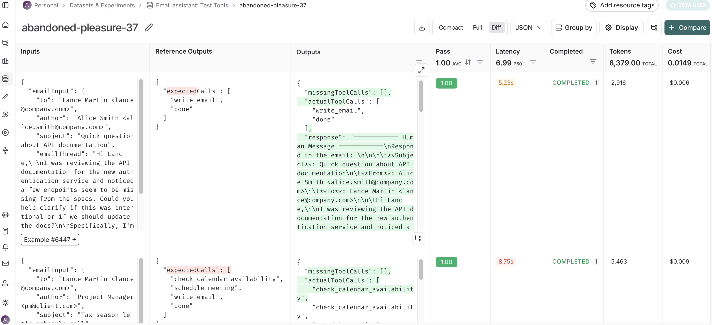
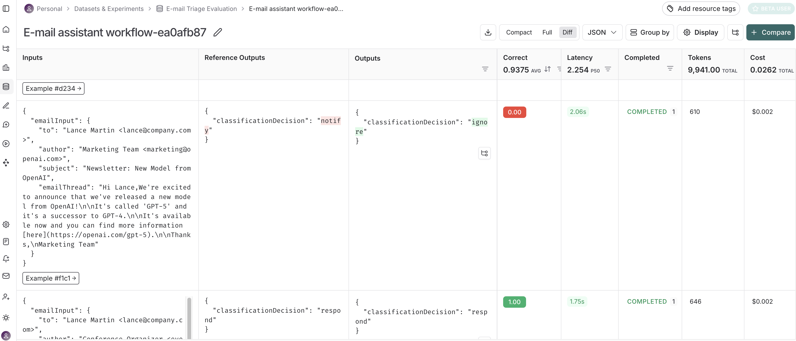

# Agent Evaluation
```
                                                                                                                 E-mail service
            ---------------                           -------------      ------------------                     /
E-mail ---> |    Agent    | ---> E-mail response ---> | Interrupt | ---> | Human Feedback | ---> Approved e-mail
input       | (LangGraph) |          draft            -------------      |  (Agent inbox) |                     \ Run agent tests
            ---------------                                              ------------------                      =================
                   ^                                                             |                               ║    Testing    ║
                   |                                                             \/                              ║  (LangSmith)  ║
           ----------------         Learn preferences over time          -------------------                     =================
           |   Memory     | <------------------------------------------- | Memory updating |
           ----------------                                              -------------------
```
Now were going to focus on testing the agent to ensure it's performs well and as expected. We can do this testing at different levels of granularity.
## Test granularity
```
                                             3. Trajectory unit test
					2. Triage unit test     --------------------------
                   ----------------------   |   E-mail responding    |  1. End-to-end test
                   |  ----> { ignore }  |   | ---------------------- |   ----------------
                   | /                  |   | |      action        | |   |              |
E-mail -----> Routing ----> { respond } ----->| LLM --------> Tool | -----> E-mail sent |
                   | \                  |   | |  ^             |   | |   |              |
                   |  ----> { notify }  |   | |  ---------------   | |   ----------------
                   ----------------------   | |     feedback       | |
                                            | ---------------------- |
											--------------------------  
________________________________________    ____________________________________________
   Simple branching step to classify            Based on the email, need different
   incoming emails, so use a Router             tools (schedule, check cal, etc)
                                                so use an Agent 	 
```
Looking at the structure of our overall system we can test it's components as well as the end-to-end setup this gives us three areas of testing:
1. **End-to-end:** evaluate the agent's final response.
2. **Triage unit test:** evaluate a triage decision.
3. **Trajectory unit test:** did my agent call the right tools, or take the right steps.

In setting up these tests there are two kinds of test we can apply to this.
||Structured|Unstructured|
|:------------:|:---------:|:-----------:|
|Output|`{classification: 'respond'}`| Hi Nick,<br><br>I just scheduled a meeting for us<br>on Tuesday at 3pm!<br><br>Best,<br>Lance|
|+|+|+|  
|Reference output|`{ground_truth: 'respond'}`|Success Criteria: Schedule a meeting on Tuesday|
|\|<br>V|\|<br>V|\|<br>V|
|Evaluator|Exact match evaluator|LLM as judge evaluator|
|=|=|=|
|Pass?|`true`|`true`|                             

In the first case we can use a simple comparison of the expected and actual outputs to see if the test is a pass or a fail. In the unstructured case were evaluating a more complex situation, was this email the right email to send? Here we use an LLM to consider if it met a description of the expected result.

Comparing these two options with our breakdown of tests above we end up with the following:
```
                Structured       Unstructured
            ------------------------------------
            |                 |         /      |
End-to-end  |                 |        /       |
            |                 |      \/        |
			------------------------------------
			|          /      |                |
Unit test   |         /       |                |
            |       \/        |                |
			------------------------------------
```
There are two ways to do this:
### Unit test framework (Vitest)
This is well understood unit test frameworks for testing JavaScript code. Some key benefits are:
* It suits complex evaluations with specific checks and success criteria.
* It integrates with LangSmith.
### LangSmith datasets
These can be created in Langsmith and run against the assistant using the LangSmith API. Benefits here are:
* You can collaborate as a team on the datasets.
* You can use production traces, annotation queues, synthetic data, etc. to add to the dataset.
* These work well with evaluators that can be applied to every test case (similarity, match accuracy, etc.).
## Test Cases
See [datasets](../shared/datasets.ts).
To start we need to define our tests, some emails to test with along with some things to test. In our case we have the following:
1. **Input e-mails:** A collection of test e-mails.
2. **Ground truth classifications:** `[respond, notify, ignore]`
3. **Expected tool calls:** Tools called for each email needing a response.
4. **Response criteria:** What makes a good response for emails needing replies?

As a result we have:
* End-to-end integration tests.
* Tests for specific steps (unit tests).

The file [datasets test](./01_datasets.test.ts) just confirms the data set loads ok before we proceed simply run this by calling:
```sh
npx tsx 01_datasets.test.ts
```

### Vitest tests
See [unit tests](./02_assistant.vitest.eval.ts).
These tests are stored in the file `assistant.vitest.eval.ts` to let us know we are testing `assistant.ts` using Vitest evaluations. To run the test use:
```sh
npx vitest run --config ls.vitest.config.ts 02_assistant.vitest.eval.ts
```
Note that this calls the Vitest [configuration](ls.vitest.config.ts) file `ls.vitest.config`, this configures the reporter to LangChain and test file definition. NB. If we wanted to run a suite of tests we would have used the call: `npx vitest run --config ls.vitest.config.ts`, now any files matching the `include` option will be run. Once the test run has completed LangSmith provides a link to the Langsmith console:



The pass in the console is determined by the call `expect(missingToolCalls.length = 0);`. The `logOutputs` call populates the **Outputs** column and the data provided to the `ls.test.each()` call can be fount in the **Inputs** column, with each row corresponding to each array element. The `ls.describe()` string forms the name of the project under **Datasets & Experiments**.

### LangSmith Datasets
```
--------------------           ---------------------            -----------------
| Dataset Examples |--inputs-->| Agent (LangGraph) |--outputs-->| Test function |---> Evaluator output
--------------------           ---------------------            -----------------
         |                                                               ^
		 ----------------------- referenceOutputs ------------------------
```
In this case rather than evaluating the entire assistant we are evaluating tool calling accuracy. We will start by looking at the triage workflow step and understanding if it makes the correct classification, especially the `response` option.

See [triage evaluation](./03_triage.eval.ts).

We start by splitting our data set into an array of inputs and an array of outputs. The inputs look like:
```javascript
inputs = [
	{
	emailInput: {
	    author: 'Alice Smith <alice.smith@company.com>',
	    to: 'John Doe <john.doe@company.com>',
	    subject: 'Quick question about API documentation',
		emailThread: 'Hi John,\n\nI was reviewing the API documentation for the new authentication service and noticed a few endpoints seem to be missing from the specs. Could you help clarify if this was intentional or if we should update the docs?\n\nSpecifically, I\'m looking at:\n- /auth/refresh\n- /auth/validate\n\nThanks!\nAlice'
		}
	},
	{
	emailInput: {
		...
		}
	},
	...
];
```
And the corresponding output file:
```javascript
outputs = [
	{classificationDecision: 'respond'},
	{classificationDecision: 'ignore'},
	...
];
```
Note that JS seems to need the inner attribute names `emailInput` and `classificationDecision` rather than sending un-named attributes, don't forget these later when you reference the inputs and outputs! Also, when we create our examples these are loaded as independent datasets unlike Python where a single example set is loaded. In JS it's important to note the `classificationEvaluator` has to return an object conforming to the `ComparisonEvaluationResult` interface, as this is used by the `evaluate` function. This is independent from the LangSmith Client `evaluateRun` function which is marked as *deprecated*.

You can run this test using the command:
```sh
npx tsx 03_triage.eval.ts
```
This will begin running the tests and provide a link to LangSmith where you can review the results.



Overall this allows us to define the input data, expected output, the function call and the test. It is the final evaluation call that uses the LangSmith API that pulls this together for us. We can use this to handle much larger data sets, and once these are in place we can continue to add tests as we see fit.

### LLM-as-Judge evaluation
See [test LLM evaluation](./04_llm.eval.ts).
Here we will see how we can use an LLM to decide if our agent executed well against some success criteria. This is based around predefining a description of the expected output, this is particularly important when evaluating responses. For example, for this `emailInput`:
```javascript
{
    author: 'Alice Smith <alice.smith@company.com>',
    to: 'Lance Martin <lance@company.com>',
    subject: 'Quick question about API documentation',
	emailThread: `Hi Lance,

	I was reviewing the API documentation for the new authentication service and noticed a few endpoints seem to be missing from the specs. Could you help clarify if this was intentional or if we should update the docs?

	Specifically, I'm looking at:
	- /auth/refresh
	- /auth/validate

	Thanks!
	Alice`
}
```
Our response criteria could say:
```
• Send email with write_email tool call to acknowledge the question and confirm it will be investigated
```
A difficulty with the LLM as evaluator approach is getting the response criteria correct so that the evaluation is what we expect but not overly specific. For example here we are specific about the tool call but more general about the content. These need to be crafted quite carefully.

The next issue is defining the system prompt we use to make this assessment, this is critical in getting appropriate assessments and is likely to take many iterations to perfect. For example this is the `RESPONSE_CRITERIA_SYSTEM_PROMPT` used here:
```
You are evaluating an email assistant that works on behalf of a user.

You will see a sequence of messages, starting with an email sent to the user.

You will then see the assistant's response to this email on behalf of the user, which includes any tool calls made (e.g., write_email, schedule_meeting, check_calendar_availability, done).

You will also see a list of criteria that the assistant's response must meet.

Your job is to evaluate if the assistant's response meets ALL the criteria bullet points provided.

IMPORTANT EVALUATION INSTRUCTIONS:
1. The assistant's response is formatted as a list of messages.
2. The response criteria are formatted as bullet points (•)
3. You must evaluate the response against EACH bullet point individually
4. ALL bullet points must be met for the response to receive a 'True' grade
5. For each bullet point, cite specific text from the response that satisfies or fails to satisfy it
6. Be objective and rigorous in your evaluation
7. In your justification, clearly indicate which criteria were met and which were not
8. If ANY criteria are not met, the overall grade must be 'False'

Your output will be used for automated testing, so maintain a consistent evaluation approach.
```
This then directs the LLM to look at the messages and check which tool was called and that the response contained the salient features. It is also very specific about how the evaluation is to be carried out, this level of detail is what is needed to ensure consistent test results from the LLM.

Running this we can call:
```sh
npx tsx 04_llm.eval.ts
```
This should respond to the console with something like:
```javascript
{
  justification: `The assistant's response meets the criteria. It uses the write_email tool to send an email to Alice, acknowledging her question about the missing API endpoints and confirming that the issue will be investigated. The email content states: "Thank you for pointing this out. I'll investigate whether the /auth/refresh and /auth/validate endpoints were intentionally omitted from the API documentation or if an update is needed. I'll review the specs and coordinate with the relevant team, and I’ll get back to you with a clear answer by end of day tomorrow." This directly acknowledges the question and confirms investigation, satisfying the requirement.`,
  classification: true
}

```
#### Running this as a suite
See [LLM suite](./05_suite.vitest.eval.ts).
Here we combine everything we just did above with Vitest so it is possible to view the results in the LangSmith. To run this call:
```sh
npx vitest run --config ls.vitest.config.ts 05_suite.vitest.eval.ts
```
