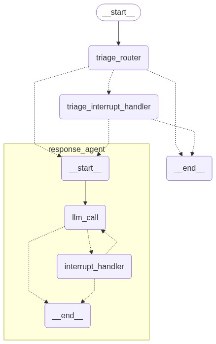
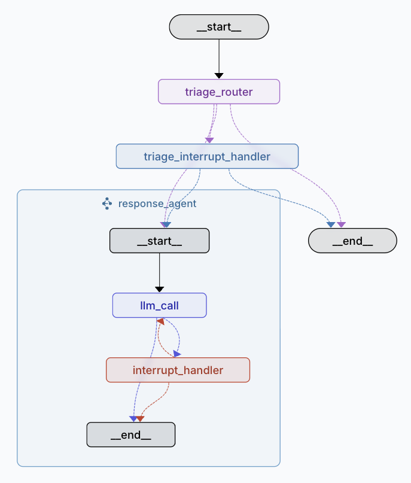
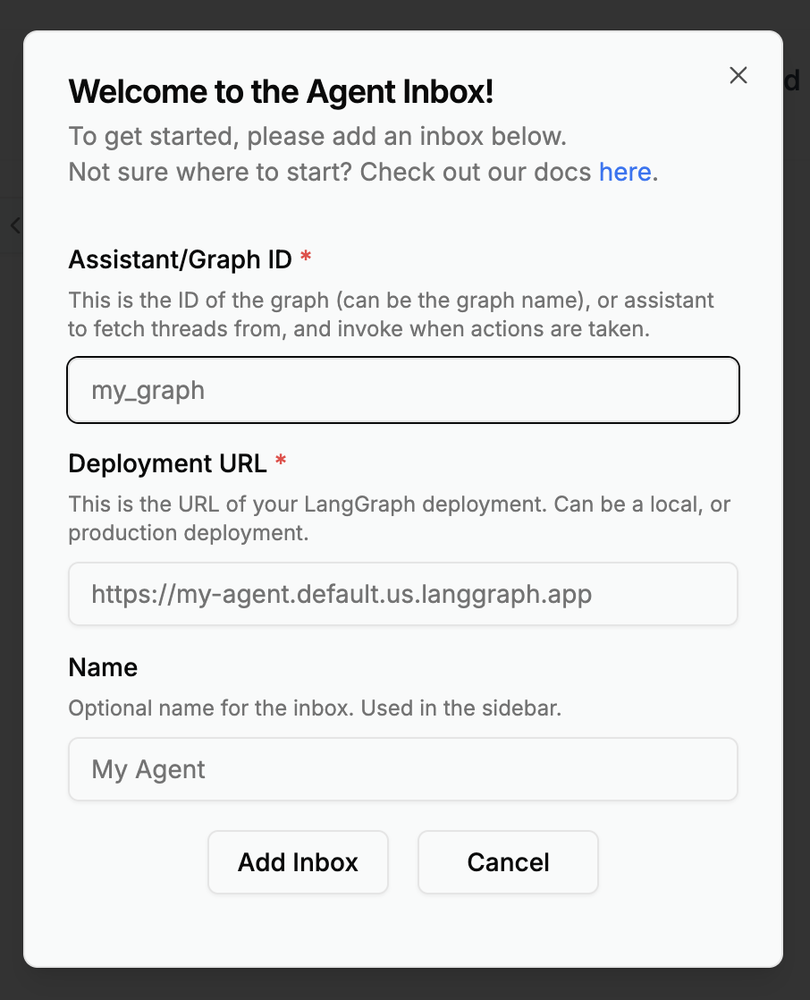

# Human In The loop (HITL)
```
                                                                                                                 E-mail service
            ---------------                           -------------      ==================                     /
E-mail ---> |    Agent    | ---> E-mail response ---> | Interrupt | ---> ║ Human Feedback ║ ---> Approved e-mail
input       | (LangGraph) |          draft            -------------      ║  (Agent inbox) ║                     \ Run agent tests
            ---------------                                              ==================                      -----------------
                   ^                                                             |                               |    Testing    |
                   |                                                             \/                              |  (LangSmith)  |
           ----------------         Learn preferences over time          -------------------                     -----------------
           |   Memory     | <------------------------------------------- | Memory updating |
           ----------------                                              -------------------
```
Continuing our tour of this high-level view of things, we are going to look at how we get human feedback into what the agents are doing. Do we trust the agents to send emails for us or do we want some say on the matter? There are two places in which we may want to step in to provide human feedback:
```
                                                 E-mail responding
                      ----> { ignore }        ----------------------
                     /                        |      action        |
E-mail -----> Routing ----> { respond } ----->| LLM ----X---> Tool | -----> E-mail sent
	                 \                        |  ^      ^      |   |
	                  ----> { notify } X- - ->|  -------|-------   |
                                       ^      |     feed|back      |
                                       |      ----------|-----------
                                       |                |
                                     human            human
                                   feedback          feedback
```
At each of the points `X` we want the graph to pause and to await for that input.
## Agent Inbox
This simple interface let's us see messages from agents, we can drill down into their work and see what further information the agent needs or provide feedback.
## Building the assistant
The assistant we are building is the same assistant we constructed in *Building Agents* then tested in *Agent Evaluation*. We are taking that basic assistant and adding some features.
### New tool
See [tools](../shared/tools.ts).

In the tools file the `question` tool is there. This allows the agent to ask the user questions about the action they intend to take or to request further clarification. This also has the updated `HITL_TOOLS_PROMPT` that makes the agent aware of the new tool.
### Triage updates
The routing is the same as before with a difference at`notify`. If the decision is to notify the user then we will transition to a new node `triage_interrupt_handler` which posts the notification to the agent inbox.
```
                      Triage Router
           ---------------------------------
           |     'respond' ----------------|-->
           |                               |
		   |                  user         |
           |                decision       |
           |                   /\  respond |
E-mail --->| LLM 'notify' ----<  >---------|-->
           |                   \/          |
           |                   |           |
           |                 ignore        |
           |                   |           |
           |                   V           |
           |     'ignore' --> END          |
           ---------------------------------
```
#### New node
The node we are adding to the `notify` decision, the `triage_interrupt_handler`, has two key functions:
1. Show the classification to the user: add the classification to the interrupt.
2. Let the user respond: handle the Agent Inbox response.
To do this we create a `request` object in the `triage_interrupt_handler`, this is sent to the Agent Inbox.

This `request` object has three key attributes:
* `action_request`: The action name and any tool call arguments.
* `config`: Flags to tell the Agent Inbox what interactions are allowed.
* `description`: Details on what is requested (can be Markdown).

What's happening is we are forming the interrupt with the `request` to Agent Inbox on how to render the content as well as the content itself.

### Response agent updates
In the `callLLM` node it mostly remains as before but it includes the `HITL_TOOLS_PROMPT` that introduces the new question tool. This, combined with a new `interrupt_handler` node that deals with `response` options gives us a new set of routings internal to the response agent.

#### Interrupt handler
This is the heart of our HITL process in the agent, it will examine tool calls and decide which need review before execution. To do this it:

1. **Select Tool**: This is a list of HITL tools:
   - `write_email`: This has the most potential risk.
   - `schedule_meeting`: This can impact your calendar.
   - `question`: This needs direct interaction.
2. **Directly Execution**: Tools not on the HITL list can just be executed.
3. **Prepare Context**: For tools needing review the handler:
   - Retrieves the input email for context.
   - Formats the tool calls for display.
   - Configures the interactions allowed for the tools.
4. **Creates interrupt**: Handles the structured request with:
   - Action name and args.
   - Interaction configuration.
   - A description and proposed action.
5. **Processes Response**: Handle the human response:
   - `accept`: execute the tool with the original args.
   - `edit`: Execute the tool with updated args.
   - `ignore`: Cancel the execution.
   - `response`: Note the feedback and do not execute.

So for each of our tools that the HITL needs to deal with we can build the following table:

| Tool Selected | Response | Notes | Outcome | Finish ?  |
|:--------------|:-------|:------|:---------|:--|
|`question`|`ignore`|Ignore tool call||END|
||`respond`|Give agent an answer to the question|Answer Message||
|`write_email`|`ignore`|Ignore tool call||END|
||`respond`|Provide feedback on how to write the email|Feedback Message||
||`accept`|Accept the tool call|Invoke Tool|Done|
||`edit`|Edit the tool call|Invoke Tool (edited args)|Done|
| `schedule_meeting`|`ignore`|Ignore tool call||END|
||`respond`|Provide agent feed back on the schedule to try again|Feedback Message||
||`accept`|Accept the tool call|Invoke Tool||
||`edit`|Edit the tool call|Invoke Tool (edited args)||

### HITL patterns review
See the updated [assistant](./assistant.ts).

**Triage Interruption**: if an email is classed as `notify` the system shows it to the user:
* *User decision* ignore it or provide feedback.
* *Control flow* end if ignored or send feedback to the response agent.

**Write email**: show a draft email to the user:
* *User decision, Control flow*: ignore and end, respond with feedback, accept and continue or edit details and continue.

**Schedule meeting**: show the proposed meeting to the user:
* *User decision, Control flow*: ignore and end, respond with feedback, accept and continue or edit details and continue.

**Question**: Ask the user for further information:
* *User decision, Control flow*: ignore and end, respond with answer.


If you uncomment the last line to the `showGraph` function this will generate an image like the above in the `shared` directory. Generating this on the command line results in an unreadable result. To do this jun the graph with the line uncommented using:
```sh
npx tsx assistant.ts
```
## Calling Interrupts
When we hit the interrupt the graph is paused before the tool call takes place. You can see the tool name in the `action` property and the `args` to accompany it. To handle the interrupt we use the `Command` interface. So far we have used it to:
* `goto`: route to the next node.
* `update`: modify the state.

Here we will use another feature:
* `resume`: provide a return value from an interrupt.

The return value should match the expected values according to the graph, in our case a `type` that can be `accept`, `edit`, `ignore` or `response`. Therfore returning `{type: 'accept'}` to the `resume` will continue our graph using the `accept` path.

### Review and accept
See [review and accept](./01_review_accept.ts).

This is relatively straight forward, we stream the response from the graph until we hit the interrupt (we examine it), then we use a Command to accept both the tool call results.

### Review and edit
See [review and edit](./02_review_edit.ts).

This shows how the user can take control of the details of agent actions while letting the system take care of making the actions itself.  In this example instead of accepting the tool calls (See previous example), they decide to make changes. This results in the following.
#### schedule_meeting
1. The meeting schedule is proposed in the Action Request.
2. The user decides to change the parameters:
   * The date is changed and duration is set to 30 mins (instead of the proposed 40 mins).
   * Everything else is the same.
3. The response type is set to `edit` and the new args are included.
4. The interrupt handler updates the tool call.
5. The tool is executed with the new args.
#### write_email
1. The agent proposes an email that includes the new 30 min time slot.
2. The use decides to update the email:
   * They rewrite it to be a lot shorter and less formal.
   * They correct the meeting date, the agent has the wrong date!
   * They request confirmation of the meeting.
3. The response type is set to `edit` and the new email content is included.
4. The interrupt handler updates the tool call.
5. The tool is executed with the new args.

When reviewing the messages it is important to note that our changes are reflected in the tool call. It's important that this is the case as if we did not update the tool call what we would see in messages would be a tool call requesting the initial request and a tool result reflecting the new request, these would not be consistent and could confuse the agent later on. By updating the call and the result we ensure a consistent sequence.
### Review and respond
See [review and respond](./03_review_respond.ts).

Here the user doesn't make the changes directly to the tool but provides the agent feedback on the proposed action and lets the agent itself rework the proposed action, this loop can continue until the user decides to take a different action, such as `accept`. In this example, again using the same e-mail, the following happens:

1. The agent proposes a meeting schedule.
2. The user decides to `respond` asking:
   * for a 30 minute meeting.
   * for something after 2pm.
3. The agent proposes a revised schedule.
4. The user decides to `accept`.
5. An e-mail draft is proposed.
6. The user provides a `respond` asking:
   * A shorter less formal e-mail.
   * A specific close statement.
7. The agent provides a new e-mail draft.
8. The user decides to `accept`.

In this case the agent was responsible for making all of the tool call changes and executing the tools and the user just provided feedback. This is very effective when:
* Changing the style of content and it's tone.
* Adding new context or context the agent missed.
* Redirecting the approach the agent took.
* Answering a question that shapes future steps.

### Interrupt tool
See [question tool](./04_question_tool.ts).

This example demonstrates using an interrupt with a tool. In this case we start with a simple email asking the user about brunch.

1. Due to the question the email poses the agent calls the `question` tool.
2. The user decides to `respond` to the `question`:
   * They respond with their preferred cuisine.
3. Now with this additional information the agent shows a draft email.
4. The user decides to `accept` the draft.

This shows how an agent can use question responses to:
* let the agent gain further information.
* get direct answers as well as additional context.
* integrate the information into following actions.
* collaborate with humans to improve outcomes.

## Deploy

There is a `langgraph.json` file set up to run our `emailAsssitant` locally. We can start this by running:
```sh
npx @langchain/langgraph-cli dev
```
This should open in our browser and let us see the following graph:

We can now try sending an email through the system. In the input section below the graph, edit the JSON and try the following:
```json
{
"emailInput": {
    "author": "Alice Smith <alice.smith@company.com>",
    "to": "John Doe <john.doe@company.com>",
    "subject": "Quick question about API documentation",
	"emailThread": "Hi John,\n\nI was reviewing the API documentation for the new authentication service and noticed a few endpoints seem to be missing from the specs. Could you help clarify if this was intentional or if we should update the docs?\n\nSpecifically, I'm looking at:\n- /auth/refresh\n- /auth/validate\n\nThanks!\nAlice"
	}
}
```
When we run this it will run as far as the `interrupt_handler`. At this point out threads are stored in the `.langgraph_api` directory as this is a local deployment, a hosted deployment uses Postgres. We can connect with the interrupted threads with the Agent Inbox using this link [dev.agentinbox.ai](https://dev.agentinbox.ai/) (Note on a Mac I found I had problems in Safari so I used Opera).



The first time this opens we need to set up our inbox, here we can set the following:
* **Assistant/Graph ID**: The name in `langgraph.json`, in this case `hitl_assistant`.
* **Deployment URL:**: Where to connect to the graph, in this case locally, `http://localhost:2024`.
* **Name**: Your own identifier for the graph, for example `HITL Assistant`.

When we create this the Agent Inbox gives us a view of the stored threads and allows us interact with them. In this case we can see the interrupted `write_email` with *Requires Action* next to it. Clicking on the interrupt let's us see the interrupted thread and let's us take the available action we want. These are the actions we defined in our code. In this case we could review the email and click the *Accept* button to send the email. What this did was return a `Command` to our graph to continue the thread.
